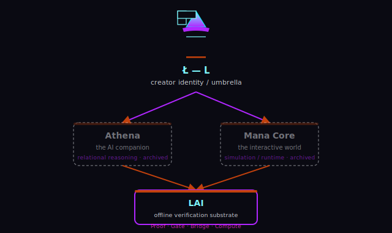

<div align="center">

# Ł L.ai

**Offline-first verification for AI. *Verify, don't trust.***

[](https://github.com/nutypebuddha/L/actions/workflows/ci.yml)
[](LICENSE)
[](https://rust-lang.org)
[](#webassembly)
[](#quick-start)
[](https://github.com/nutypebuddha/L/releases/tag/v0.4.1)


</div>

---

## What is this?

**L.ai** is a single binary that does four things — all deterministic, all
fail-loud, no network required at runtime:

| | Component | What it does |
|---|-----------|--------------|
| 🔍 | **Proof** | Deterministic reasoning engine: NAND-to-verify cascade, embedded corpus, machine-checkable proof objects, local LLM assistant (MCP) |
| 🛡️ | **Gate** | Per-token validation for LLM output — math, logic, fact, fallacy, bias. ~630KB pure Rust + WASM |
| 🔗 | **Bridge** | Universal MCP bridge — any chatbot (Claude, GPT, Grok, Mistral) hooks into Gate validation through one endpoint |
| 🌐 | **Athena** | Relational reasoning engine — cross-domain formula graph, 30+ subcommands |

## Why does it exist?

LLM output is probabilistic. L.ai refuses to trust it. Instead of asking a model
"is this true?", L.ai runs candidate claims through **deterministic verification**
— math gates, logic gates, a fact corpus, and a NAND-based proof core — and
returns either a machine-checkable **proof object** or a typed **refusal**.

```
LLM → Candidate → Proof → Accepted
                 ↓
              Refused (unverifiable)
```

That is a more robust long-term direction than `LLM → Truth`.

## Features

- **Deterministic reasoning** — NAND-to-verify cascade; no stochastic generation.
- **Per-token validation (Gate)** — 7 gates: math, logic, fact, fallacy, bias, confidence, structure.
- **Embedded corpus** — 214 entities and 528 formulas (proof corpus), content-addressed, compiled in. Athena adds 350 more formulas across its wheel.
- **Machine-checkable proofs** — every answer carries a proof object or a refusal.
- **Universal bridge** — one MCP endpoint validates any chatbot's output.
- **Offline-first** — zero network at runtime. No model? It answers from the verified corpus and tells you it did.
- **Multi-platform** — Linux, Android (stdio MCP daemon), and WASM.

## Architecture

```
lai/
├── proof/      L.ai · Proof  → unified `lai` binary
├── gate/       L.ai · Gate   → per-token validation (Rust + WASM)
├── athena/     L.ai · Athena → relational reasoning (30 subcommands)
├── bridge/     L.ai · Bridge → MCP bridge (Node.js/TypeScript)
└── android-app/              → Android APK (stdio MCP daemon)
```

### NAND-to-verify cascade

Every answer goes through the same path:

```
Input → Tokenize → Gate (per-token) → Proof (NAND core) → Corpus → Output
                                         ↓
                                    Refuse if unverifiable
```

No network. No stochastic generation. No confidence scores — just pass/fail with diagnostics.

## Quick start

```bash
# Build the unified binary
cargo build --release -p laverna

# Validate an expression
./target/release/lai validate "9.11 < 9.9"

# Run the deterministic engine
./target/release/lai tanto eval "2 + 3 * 4"

# Start the MCP assistant (stdio transport)
./target/release/lai assistant --mcp

# Gate: validate LLM output tokens
./target/release/lai gate validate "The earth is flat"
```

No model? The engine still answers from the verified corpus and tells you it did —
**it never fabricates.**

## Benchmarks

- `strategize --budget 30` completes in **~0.6s** (LP-relaxation branch-and-bound; was exponential blowup before the fix).
- Gate + Proof compile to **~630KB** pure Rust, with a **~630KB WASM** target.
- Workspace: **625+ tests**, clippy-clean under `-D warnings`.
- `cargo test -p laverna --features graph,milp` → 545 tests, 0 failures.

```bash
cargo test --workspace           # 625+ tests
cargo clippy --all-targets       # lint gate
cargo fmt -- --check             # format check
```

## WebAssembly

```bash
# Proof + Gate as WASM (~630KB)
cargo build --release --target wasm32-unknown-unknown -p laverna-wasm
cargo build --release --target wasm32-unknown-unknown -p lai-gate-wasm
```

## Android

The Android APK runs L.ai as an MCP daemon over stdio — zero network, zero localhost sockets:

```bash
cd android-app && ./gradlew assembleDebug
# Output: android-app/app/build/outputs/apk/debug/app-debug.apk
```

## The L ecosystem

L is a growing platform — one mark, one contract: **deterministic verification
instead of probabilistic trust.**

```
L
├── Core        L.ai · Proof / Gate / Bridge / Compute  (verification substrate)
├── Athena      relational reasoning engine  [archived reference]
├── CLI         lai — one binary, four functions
├── SDK         lai-core — shared domain types + error hierarchy
├── Plugins     MCP tools, LLM adapters, validators
└── Examples    WASM playground, Android daemon, demos
```

> **Athena** and **Mana Core** are archived reference projects in the ecosystem.
> Active development continues in **L.ai** (this repo).



## Roadmap

- [x] `lai-core` shared domain types + unified `LaiError` hierarchy
- [x] Repo hygiene — artifacts removed, clean 1.2MB source archive
- [x] Athena eval memoization (`memo` feature)
- [ ] Incremental / parallel proof inference (Rayon)
- [ ] Persistent on-disk proof-fragment cache
- [ ] WASM demo playground
- [ ] Mana Core linkage into the ecosystem map

## License

Apache-2.0. See [LICENSE](LICENSE) and [NOTICE](NOTICE). Brand system in
[docs/BRAND.md](docs/BRAND.md).

<div align="center">

*Verify, don't trust.* — [L.ai](https://github.com/nutypebuddha/L)

</div>
